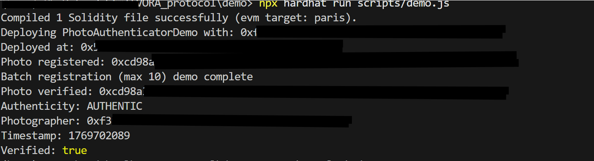
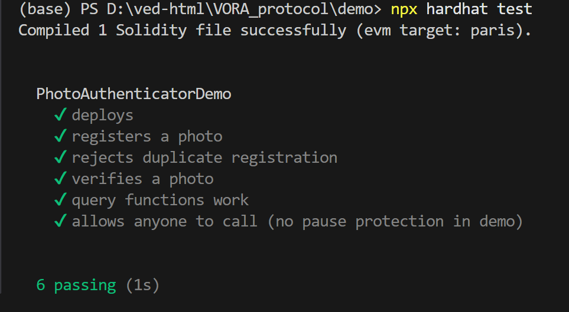

# VORA Protocol Demo

## Verification of Origin and Reality Authenticity (VORA)

<p align="center">
  
</p>

## Overview

VORA stands for Verification of Origin and Reality Authenticity, a protocol designed to ensure the authenticity and origin of digital photographs through blockchain-based verification. This addresses critical challenges in digital media integrity, providing immutable proof-of-origin and tamper-evident verification for photographic content.

This repository contains a minimal on-chain proof-of-concept implementation of the VORA protocol, demonstrating core verification mechanisms without enterprise-grade security features.

> **WARNING: NOT FOR PRODUCTION USE**
>
> This demo implementation omits essential security layers, enterprise logic, and production safeguards. It is strictly intended for educational and evaluation purposes. Commercial or production deployment requires a licensed version of the VORA Protocol.

## What This Demo Includes

- Minimal smart contract (PhotoAuthenticatorDemo.sol) for registering and verifying photo hashes on-chain
- Batch registration functionality limited to 10 entries per transaction
- Basic verification scripts demonstrating protocol flow
- Automated test suite for core functionality validation
- No administrative controls, fee structures, or upgrade mechanisms
- No integration with external oracles or advanced metadata handling

## Proof of Concept

This section demonstrates the successful execution of the VORA Protocol Demo:



*Figure 1: Successful execution of the demo script, showcasing photo registration and verification flow.*



*Figure 2: Automated test suite passing, confirming core protocol functionality.*

## How to Run the Demo

Navigate to the demo directory and execute the following commands:

1. **Install dependencies:**
   ```bash
   npm install
   ```

2. **Compile contracts:**
   ```bash
   npx hardhat compile
   ```

3. **Run the demo script:**
   ```bash
   npx hardhat run scripts/demo.js
   ```

4. **Run the test suite:**
   ```bash
   npx hardhat test test/demo.test.js
   ```

## Security Model

This demo implements a simplified security model suitable only for proof-of-concept purposes. It lacks production-grade protections such as access controls, pausing mechanisms, and comprehensive validation. For detailed security considerations and limitations, refer to [docs/SECURITY_MODEL.md](docs/SECURITY_MODEL.md).

## Commercial Use & Licensing

This demo is provided for learning, evaluation, and internal review purposes. It demonstrates the foundational concepts of the VORA Protocol but does not include the security, scalability, or enterprise features required for commercial applications.

Production or commercial usage of the VORA Protocol requires a separate commercial license. This repository does not grant any rights for production deployment, redistribution, or commercial integration.

For licensing inquiries:

- **Email:** vedkumar755@gmail.com
- **Subject:** "Commercial License Inquiry"
- Please provide your company name, intended use, and contact details.

---

© 2026 VORA Protocol. All rights reserved.
